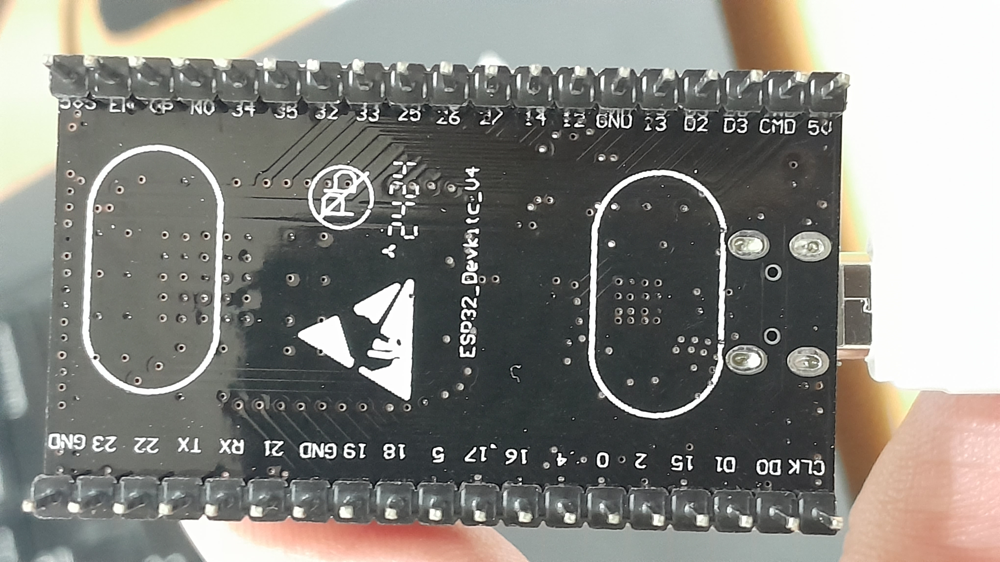

# envmon
Simple monitoring device using ESP32 and MQTT  

### Hardware and components
- DOIT ESP32 DEVKIT V1
- OLED SSD1306
- DHT11
- LDR
- Resistor 10k

### How to monitor  
mosquitto_sub -h 192.168.8.192 -p 1885 -t topic/light -F "%I %t %p" >> mqtt-light.log

### How it looks like
)  
  
)
